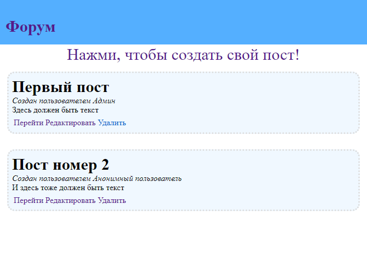
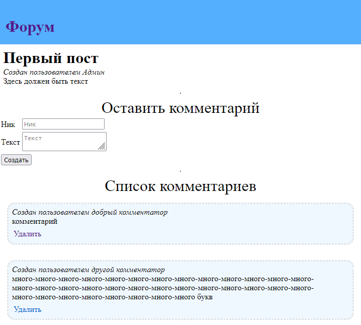

# Домашнее задание №18
## Основное
Реализовать CRUD приложение с использованием spring web (mvc) + бд (фронт по желанию)

### Решение
Сделал CRUD приложение-форум.  
Функционал:
<li>Создавать, редактировать и удалять посты</li>
<li>Просматривать список всех постов</li>
<li>Просматривать страницу каждого отдельного поста с комментариями к нему</li>
<li>Создавать и удалять комментарии к постам</li>
Домашняя страница находится по адресу http://localhost:8080

### Конфигурация
В проекте используется PostgreSQL.
Перед запуском нужно настроить подключение к базе данных в файле application.yml

Для создания базы использовал flyway. С помощью него же туда добавляется несколько записей в демонстрационных целях.  
**Тесты** (кроме тех, что из пакета <code>com.sawwere.sber.homework18.crud.controller</code>) используют **testcontainers** - для их запуска требуется иметь **докер**.

### Пример работы


## Дополнительно 1
🔥 Перенести проект из темы
Exceptions в парадигму web’a

### Решение
В целом логика осталась той же самой, для выполнения всех операций со счетом необходимо сначала авторизоваться, 3 неверных попытки приведут к блокировке на 10 секунд и т.д.

#### Список поддерживаемых запросов

#### Логин
- **POST**  **/api/v1/auth/login**
- Параметры: ```pin``` - пин-код для входа (правильный пин задается в AuthService и по умолчанию равен ```1234```)

#### Получить текущий баланс
- **GET** **/api/v1/balance**
- Response: целое число - баланс счета
#### Вывод средств со счета
- **POST**  **/api/v1/balance/withdraw**
- Параметры: ```amount``` - целое неотрицательное и кратное 100 число - сумма снятия
#### Пополнение счета
- **POST**  **/api/v1/balance/deposit**
- Параметры: ```amount``` - целое неотрицательное и кратное 100 число - сумма пополнения

## Дополнительно 2
🔥🔥Написать WEB-приложение c сервлетом|сервлетным фильтром, который осуществляет получение содержимого удалённого ресурса и возвращает его в своём ответе (GET запрос).
Ссылка на ресурс передаётся в параметре url исходного запроса.

### Решение
Приложение предоставляет единственный эндпоинт http://localhost:8080/recourse?url=<ссылка>