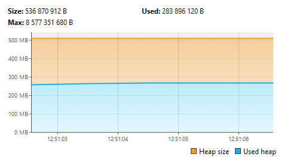
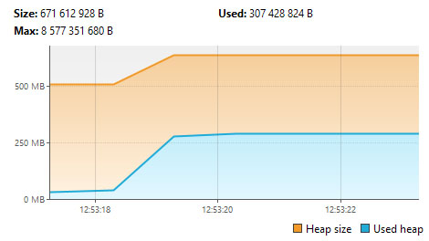
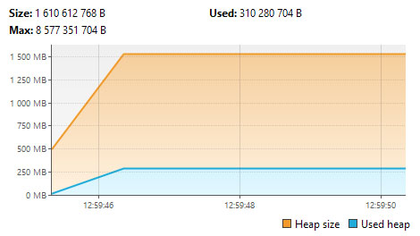

# Домашнее задание №25

## Задание 1
Сделать цикл на 100000 итераций, в цикле в предварительно созданную Map<Integer, String> сложить ключ - индекс, значение - "value" + индекс  
### Запустить с опцией -XX:+PrintCompilation, проанализировать информацию в консоли  
Фрагмент вывода: 
```
125   82       3       java.util.HashMap::put (13 bytes)   made not entrant
125  258       4       java.util.HashMap::resize (356 bytes)
125  259       4       java.lang.Integer::stringSize (47 bytes)
126  267       4       java.lang.Integer::getChars (131 bytes)
127  239       3       java.lang.Integer::stringSize (47 bytes)   made not entrant
127  279       4       java.util.HashMap::hash (20 bytes)
127   75       3       java.util.HashMap::hash (20 bytes)   made not entrant
127  260       4       java.lang.StringConcatHelper::prepend (37 bytes)
128  241       3       java.lang.Integer::getChars (131 bytes)   made not entrant
128  261       4       java.lang.String::getBytes (44 bytes)
128  232       3       java.lang.StringConcatHelper::prepend (37 bytes)   made not entrant
128  262       4       java.lang.StringConcatHelper::newArray (26 bytes)
129  233       3       java.lang.String::getBytes (44 bytes)   made not entrant
129  263       4       jdk.internal.misc.Unsafe::allocateUninitializedArray (55 bytes)
129  234       3       java.lang.StringConcatHelper::newArray (26 bytes)   made not entrant
129  264       4       jdk.internal.misc.Unsafe::allocateUninitializedArray0 (90 bytes)
130  235       3       jdk.internal.misc.Unsafe::allocateUninitializedArray (55 bytes)   made not entrant
130  240       3       jdk.internal.misc.Unsafe::allocateUninitializedArray0 (90 bytes)   made not entrant
```
Лог состоит из строк вида (на примере HashMap::hash)
```
127 279 4 java.util.HashMap::hash (20 bytes)

    127 — время (милисекунды) с момента запуска
    279 — уникальный ID компиляции
    4 — уровень компиляции (4 = C2, также встречаются 0, 1 и 3)
    (20 bytes) - размер метода в байтах
    
```
Видно, что многие метды помечены как **made not entrant** - т.е. для них произошла деоптимизация и перекомпиляция

### Запустить с опцией -XX:+PrintCompilation -XX:+UnlockDiagnosticVMOptions -XX:+PrintInlining , проанализировать информацию в консоли
Фрагмент вывода:
```
146  248       3       java.lang.StringConcatHelper::prepend (22 bytes)   made not entrant
                              @ 3   java.lang.StringConcatHelper::prepend (30 bytes)   inline (hot)
                                @ 12   java.lang.Integer::getChars (131 bytes)   inline (hot)
                              @ 16   java.lang.StringConcatHelper::prepend (37 bytes)   inline (hot)
                                @ 2   java.lang.String::length (11 bytes)   inline (hot)
                                  @ 6   java.lang.String::coder (15 bytes)   inline (hot)
                                @ 21   java.lang.String::getBytes (44 bytes)   inline (hot)
                                  @ 1   java.lang.String::coder (15 bytes)   inline (hot)
                                  @ 22   java.lang.System::arraycopy (0 bytes)   (intrinsic)
147  274 %     3       com.sawwere.sber.homework25.GITTask::main @ 10 (40 bytes)
                          @ 4   java.util.HashMap::<init> (11 bytes)   inline
                            @ 1   java.util.AbstractMap::<init> (5 bytes)   inline
                              @ 1   java.lang.Object::<init> (1 bytes)   inline
                          @ 18   java.lang.Integer::valueOf (32 bytes)   inline
                            @ 28   java.lang.Integer::<init> (10 bytes)   inline
                              @ 1   java.lang.Number::<init> (5 bytes)   inline
                                @ 1   java.lang.Object::<init> (1 bytes)   inline
                          @ 22   java.lang.invoke.Invokers$Holder::linkToTargetMethod (9 bytes)   force inline by annotation
                            @ 5   java.lang.invoke.LambdaForm$MH/0x000002aecd003400::invoke (75 bytes)   force inline by annotation
                              @ 15   java.lang.invoke.LambdaForm$MH/0x000002aecd003000::invoke (27 bytes)   force inline by annotation
                                @ 23   java.lang.invoke.DirectMethodHandle$Holder::invokeStatic (17 bytes)   force inline by annotation
                                  @ 1   java.lang.invoke.DirectMethodHandle::internalMemberName (8 bytes)   force inline by annotation
                                  @ 13   java.lang.StringConcatHelper::mix (11 bytes)   inline
                                    @ 2   java.lang.Integer::stringSize (47 bytes)   callee is too large
                                    @ 7   java.lang.StringConcatHelper::checkOverflow (17 bytes)   inline
                                      @ 13   java.lang.OutOfMemoryError::<init> (6 bytes)   don't inline Throwable constructors
                              @ 31   java.lang.invoke.DirectMethodHandle$Holder::invokeStatic (14 bytes)   force inline by annotation
                                @ 1   java.lang.invoke.DirectMethodHandle::internalMemberName (8 bytes)   force inline by annotation
                                @ 10   java.lang.StringConcatHelper::newArray (26 bytes)   force inline by annotation
                                  @ 19   jdk.internal.misc.Unsafe::allocateUninitializedArray (55 bytes)   callee is too large
                              @ 51   java.lang.invoke.LambdaForm$MH/0x000002aecd002400::invoke (32 bytes)   force inline by annotation
                                @ 28   java.lang.invoke.DirectMethodHandle$Holder::invokeStatic (21 bytes)   force inline by annotation
                                  @ 1   java.lang.invoke.DirectMethodHandle::internalMemberName (8 bytes)   force inline by annotation
                                  @ 17   java.lang.StringConcatHelper::prepend (22 bytes)   callee is too large
                              @ 71   java.lang.invoke.DirectMethodHandle$Holder::invokeStatic (17 bytes)   force inline by annotation
                                @ 1   java.lang.invoke.DirectMethodHandle::internalMemberName (8 bytes)   force inline by annotation
                                @ 13   java.lang.StringConcatHelper::newString (67 bytes)   callee is too large
                          @ 27   java.util.Map::put (0 bytes)   no static binding
148  100       3       java.util.HashMap::resize (356 bytes)   made not entrant
```
Основные наблюдения
- StringConcatHelper::prepend помечен как made not entrant, что указывает на деоптимизацию из-за изменения условий выполнения
- Метод HashMap::resize деоптимизирован (made not entrant), что происходит из-за частого изменения размера хеш-таблицы из-за добавления большого количества элементов
- Видно активное использование LambdaForm и MethodHandler-ов, что характерно для лямбда выражений или рефлексивных вызовов
- Аннотации force inline by annotation указывают на принудительный инлайнинг
- Некоторые методы (например, Unsafe::allocateUninitializedArray, StringConcatHelper::newString) слишком большие для инлайнинга
- Конструктор OutOfMemoryError не инлайнится - видимо JVM избегает инлайна конструкторов исключений

## Задание 2
Из %JAVA_HOME%\bin запустить jvisualvm, установить через пункт меню Tools\Plugins\Available Plugis плагин: Visual GC  
Запустить приложение создающее много объектов с разными GC, посмотреть в jvisualvm как заполняются объекты в разных областях памяти(heap)  
#### -XX:+UseSerialGC  


#### -XX:+UseParallelGC  


#### -XX:+UseG1GC  

